# Ansible Log Viewer

A terminal UI for browsing `ansible-playbook` run history, plus a small wrapper
that runs your daily playbook and records the logs the viewer reads.

If you run a playbook on a schedule across a fleet, you end up with a pile of
logs and no good way to answer "what changed last night, and did anything
break?" These tools fix that: `run-daily.py` runs the playbook and writes a
timestamped log; `view-logs.py` turns those logs into a browsable history with
per-host drill-down, task timings, warnings, and run-over-run diffs.

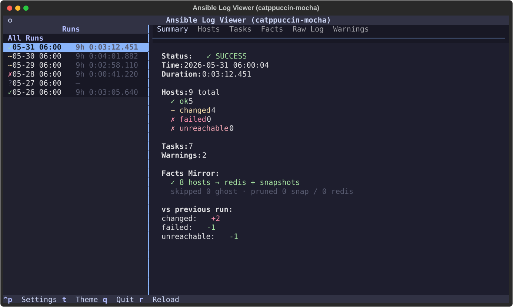

Everything is a self-contained [`uv`](https://docs.astral.sh/uv/) script with
inline dependencies — no virtualenv to manage, no `pip install` step.

## What's in the box

| Script | What it does |
|---|---|
| **`view-logs.py`** | The TUI. Reads `daily-*.log` files and shows a per-run summary, a sortable hosts table, task durations, LXC template state, raw log, warnings, and an aggregate "all runs" view with a success trend. Six themes. |
| **`run-daily.py`** | Runs your playbook (`ansible-playbook`), streams output live, writes a timestamped `.log`/`.err` pair, holds a lock so two runs can't overlap, rotates logs older than 30 days, prints a summary table, and optionally pings Discord on failure. |
| **`facts.py`** | *(Optional.)* Reads Ansible's jsonfile fact cache and writes curated per-host YAML snapshots that enrich the viewer's Hosts/Facts tabs (distro, kernel, CPU, RAM, IP). Can also mirror to redis and answer `list` / `host` / `query` from the CLI. |

The viewer works against **any** standard `ansible-playbook` output — you do not
need the other two scripts. `run-daily.py` just happens to produce logs in the
shape and location it expects, and `facts.py` is purely additive.

## Requirements

- [`uv`](https://docs.astral.sh/uv/) (recommended) — runs each script with its
  dependencies pinned inline, nothing to install.
- Python 3.11+ if you'd rather run them directly:
  `pip install textual rich` (add `redis` for `facts.py`'s redis mode), then
  `python view-logs.py`.
- `ansible-core` on your `PATH` for `run-daily.py` / `facts.py`.

## Quick start

```bash
# 1. try the viewer against the bundled sample logs (no config, no Ansible needed)
ALV_LOG_DIR=examples/logs ALV_HOME=examples ./view-logs.py

# 2. point it at your own setup
mkdir -p ~/.config/ansible-log-viewer
cp config.toml.example ~/.config/ansible-log-viewer/config.toml
$EDITOR ~/.config/ansible-log-viewer/config.toml   # set ansible_home + playbook

# 3. record a run, then view it
./run-daily.py
./view-logs.py
```

## Configuration

All three scripts read one TOML file, by default
`~/.config/ansible-log-viewer/config.toml` (override with `$ALV_CONFIG`). See
[`config.toml.example`](config.toml.example) for every key. The most common:

```toml
ansible_home = "~/ansible"          # where playbooks/ and inventory/ live
playbook     = "playbooks/site.yml" # what run-daily.py runs
theme        = "tokyonight-night"
```

Environment variables override the file — handy for one-off runs:

| Variable | Overrides |
|---|---|
| `ALV_CONFIG` | path to the config file itself |
| `ALV_HOME` | `ansible_home` |
| `ALV_LOG_DIR` | `log_dir` (default `~/.ansible/logs`) |
| `ALV_THEME` | `theme` |
| `ALV_CACHE_DIR` / `ALV_SNAPSHOT_DIR` | `facts.py` cache/snapshot dirs |
| `DISCORD_WEBHOOK_URL` | `[notify] discord_webhook_url` |
| `REDIS_HOST` / `REDIS_PORT` / `REDIS_PASSWORD` | the `[redis]` table |

## The viewer

```bash
./view-logs.py
```

| Key | Action |
|---|---|
| `↑`/`↓`, `j`/`k` | move through runs |
| `[` / `]` | previous / next tab |
| `f` | cycle the Hosts filter (all → failed → unreachable → changed → ok) |
| `enter` (Hosts tab) | open that host's log, filtered to just its lines (`/` to search) |
| `t` | theme switcher |
| `r` | reload logs from disk |
| `q` | quit |

Tabs: **Summary** (status, counts, facts state, diff vs the previous run),
**Hosts** (per-host recap enriched with facts), **Tasks** (durations, longest
first), **Facts** (the fact-mirror outcome), **Raw Log**, and **Warnings**
(from the `.err` file). Selecting **All Runs** shows aggregate stats, the
most-failing hosts, and a success trend.

### Screens

**Hosts** — every host's `PLAY RECAP`, colored by status and enriched with facts
(distro / version / kernel / CPU / RAM / IP). `f` cycles the filter, `enter` drills in:

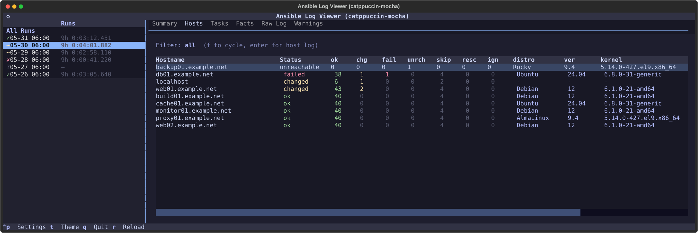

**Host drill-down** — `enter` on a host opens just that host's log lines with a live
search box (here, db01's failed PostgreSQL task on a partial run):

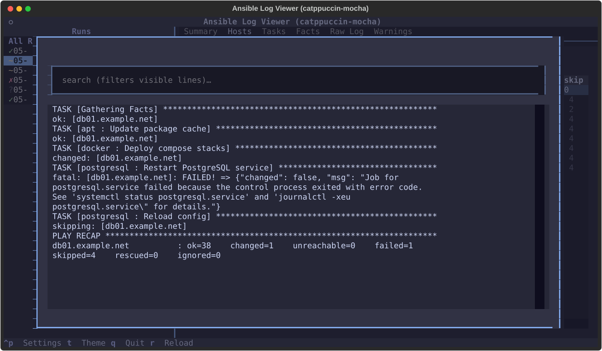

**Tasks** — per-task durations from the `profile_tasks` callback, longest first:

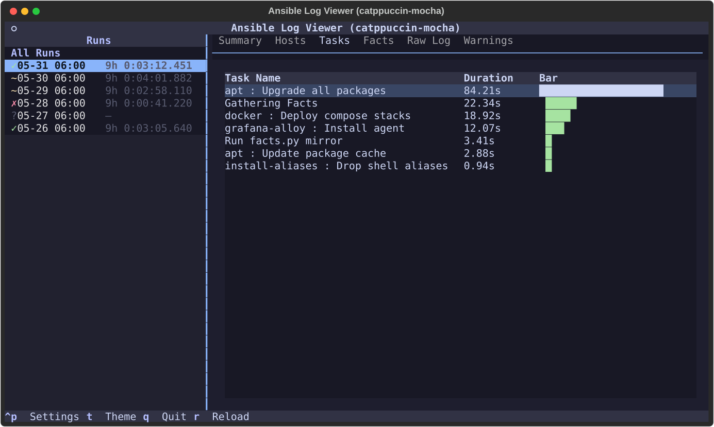

**Facts** — outcome of the optional `facts.py mirror` step for the run:

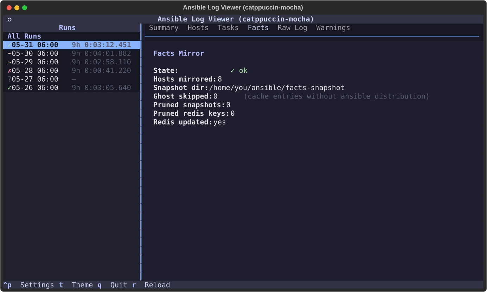

**Templates** — per-node LXC template state from the `proxmox-templates` play:
the current versions kept (the two newest majors per distro line) plus what this
run downloaded and pruned. Populated from a base64 `ALV-TEMPLATES|…` summary line
the play emits for each node; absent for logs where that play did not run.

**Raw Log** — the full `ansible-playbook` output with ANSI colors preserved:

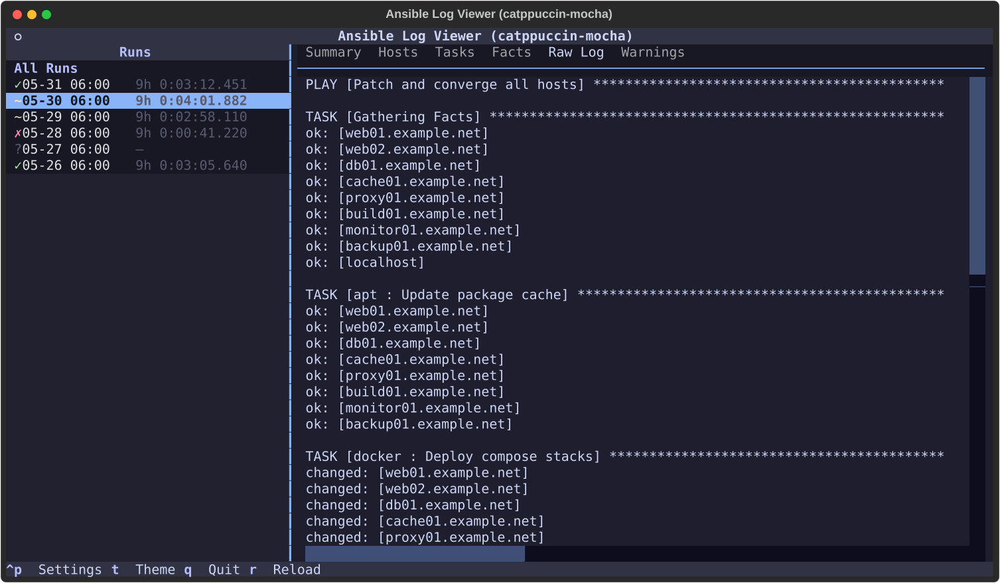

**Warnings** — whatever ansible wrote to stderr for that run:

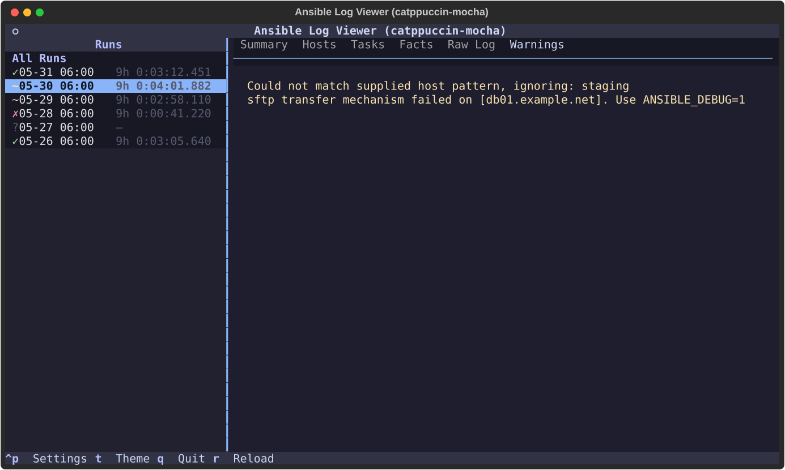

**All Runs** — aggregate success rate, most-failing hosts, and a run-over-run trend:

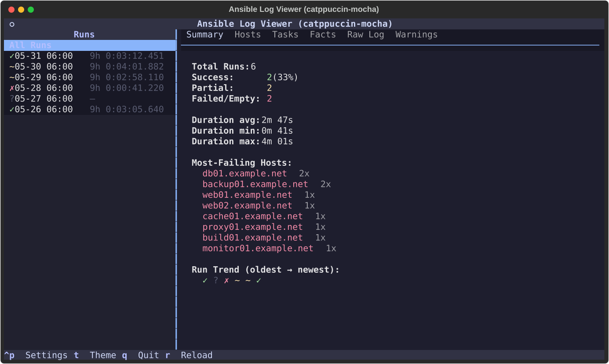

**Themes** — `t` opens a live picker; six themes ship (Catppuccin Mocha, Tokyo Night,
Oxocarbon, Moonfly, Vision, Cyberpunk 2077):

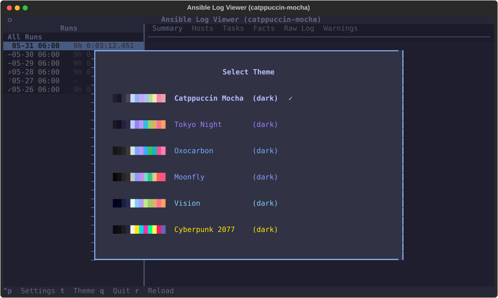
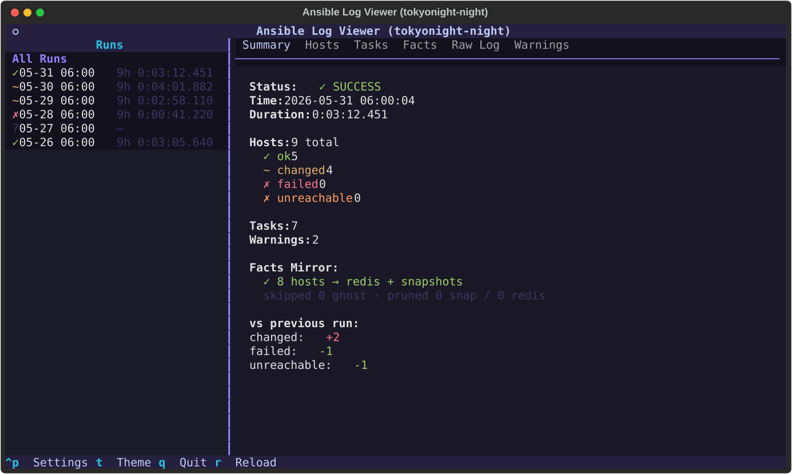
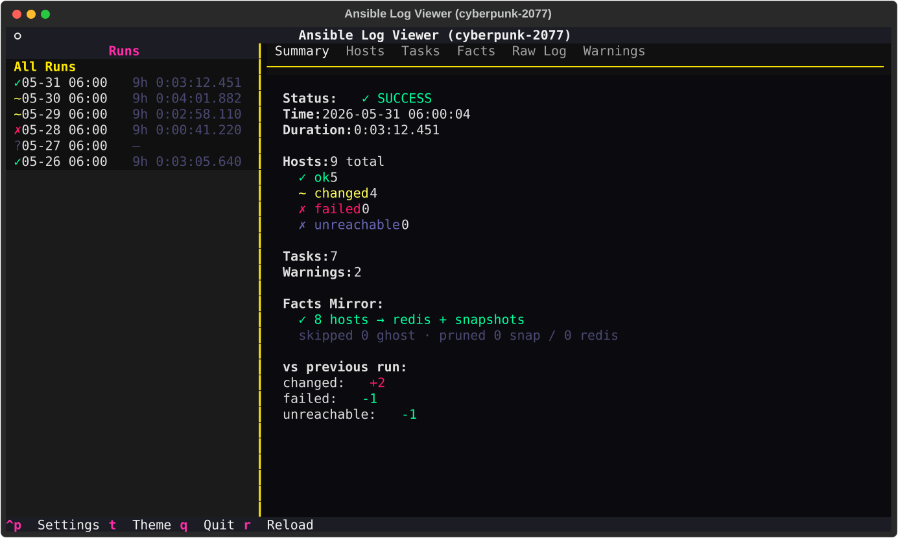
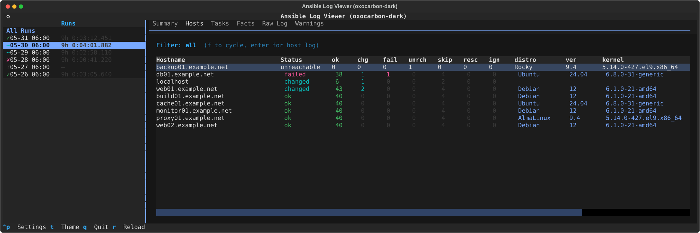

### How it finds runs (log-format contract)

The viewer scans `log_dir` for files named `daily-YYYY-MM-DD_HH-MM-SS.log` (with
an optional matching `.err`) and parses the standard `ansible-playbook` output:

- **Host table** comes from the `PLAY RECAP` block — always present.
- **Task durations** come from the `profile_tasks` callback's `TASKS RECAP`
  block. Enable it for the Tasks tab to populate, e.g. in `ansible.cfg`:
  ```ini
  [defaults]
  callbacks_enabled = profile_tasks
  ```
- **Facts** section is populated only if a `facts.py mirror` task ran; otherwise
  it reads "not run", which is expected and harmless.

`run-daily.py` produces exactly this layout, but any tool that writes
`daily-*.log` files with normal Ansible output will work.

## The daily runner — `run-daily.py`

`run-daily.py` is a thin, dependency-light wrapper around `ansible-playbook`. It
exists so an unattended run leaves behind exactly what the viewer needs and never
trips over itself:

- **Runs your playbook** with an optional inventory `--limit` — it builds
  `ansible-playbook <playbook> [--limit <pattern>]` and runs it with
  `cwd = ansible_home` and `ANSIBLE_FORCE_COLOR=1` (so the captured log keeps its
  colors for the Raw Log tab).
- **Streams output live** to your terminal *and* tees it to a timestamped
  `~/.ansible/logs/daily-YYYY-MM-DD_HH-MM-SS.log` (+ a `.err` for stderr) — the
  exact name and shape `view-logs.py` reads. Only `PLAY RECAP` lines are buffered
  in memory, so a multi-gigabyte run can't blow up the wrapper.
- **Won't overlap itself** — a `flock` on `/tmp/ansible-daily.lock` makes a second
  invocation exit immediately rather than run concurrently (safe for cron).
- **Rotates logs** older than 30 days, and prints a Rich summary table at the end
  (per-host ok/changed/failed, duration, log path).
- **Notifies on failure only** — a non-zero exit, any failed/unreachable host, or
  no `PLAY RECAP` at all (ansible crashed) POSTs a one-line summary to Discord if a
  webhook is configured; successful runs stay silent. It always exits with
  ansible's own exit code, and a notify/network hiccup never changes that.

### Using it with your own playbook

Point it at your repo and playbook in `~/.config/ansible-log-viewer/config.toml`:

```toml
ansible_home = "~/infra"             # your repo (contains playbooks/ + inventory/)
playbook     = "playbooks/site.yml"  # relative to ansible_home, or an absolute path
limit        = "all:!switches"       # optional; omit or "" = no --limit (all hosts)
```

With no config at all it defaults to `ansible_home = .` (current directory) and
`playbook = playbooks/daily.yml`, so dropping the script into your repo root and
running `./run-daily.py` from there just works. `playbook` and `limit` are
config-only (this script is meant to be your *one* scheduled converge); for an
ad-hoc run against something else, just call `ansible-playbook` directly, or point
at a different repo for a one-off with `ALV_HOME=~/other ./run-daily.py`.

**Several scheduled playbooks?** Give each its own config + log dir and select with
`$ALV_CONFIG`, then point the viewer at the matching `log_dir`:

```bash
ALV_CONFIG=~/.config/ansible-log-viewer/patching.toml ./run-daily.py
ALV_CONFIG=~/.config/ansible-log-viewer/certs.toml    ./run-daily.py
# view one set:  ALV_LOG_DIR=~/.ansible/logs/patching ./view-logs.py
```

### Failure notifications

Set a webhook in `[notify]` (or the `$DISCORD_WEBHOOK_URL` env var); leave both
unset to disable. `name` is the bot username / title prefix:

```toml
[notify]
discord_webhook_url = "https://discord.com/api/webhooks/…"
name = "infra-nightly"
```

### Scheduling

`run-daily.py` runs via `uv`, so cron/systemd need `uv` on `PATH` (or use its
absolute path). `ansible_home` comes from config, so no `cd` is required.

cron:

```cron
0 3 * * *  uv run ~/git/ansible-log-viewer/run-daily.py >> ~/.ansible/cron.log 2>&1
```

systemd user timer (survives reboots, journald logging):

```ini
# ~/.config/systemd/user/ansible-daily.service
[Service]
Type=oneshot
ExecStart=%h/.local/bin/uv run %h/git/ansible-log-viewer/run-daily.py

# ~/.config/systemd/user/ansible-daily.timer
[Timer]
OnCalendar=*-*-* 03:00:00
Persistent=true
[Install]
WantedBy=timers.target
```

Enable with `systemctl --user enable --now ansible-daily.timer`; then
`view-logs.py` gives you the history the next morning.

## The fact store (optional)

If you set `fact_caching = jsonfile` in your `ansible.cfg`, `facts.py` turns the
cache into per-host snapshots the viewer reads, and answers quick questions:

```bash
./facts.py list                              # table of all hosts
./facts.py host web01.example.net            # full facts JSON
./facts.py query --where 'ansible_distribution==Ubuntu'
./facts.py mirror                            # cache → snapshots (+ redis if configured)
```

Redis is entirely optional — without it, `facts.py` reads and writes the
jsonfile cache directly.

## Sample data & screenshots

`examples/logs/` and `examples/facts-snapshot/` contain sanitized sample data
(fictional `*.example.net` hosts, RFC 5737 IPs) covering success, partial,
failed, and crashed runs. The screenshots above are generated from it:

```bash
uv run make-screenshots.py     # writes screenshots/*.svg from examples/
```

## Running the tests

```bash
uv run --with pytest --with textual --with rich pytest
```

## License

[Apache 2.0](LICENSE).
